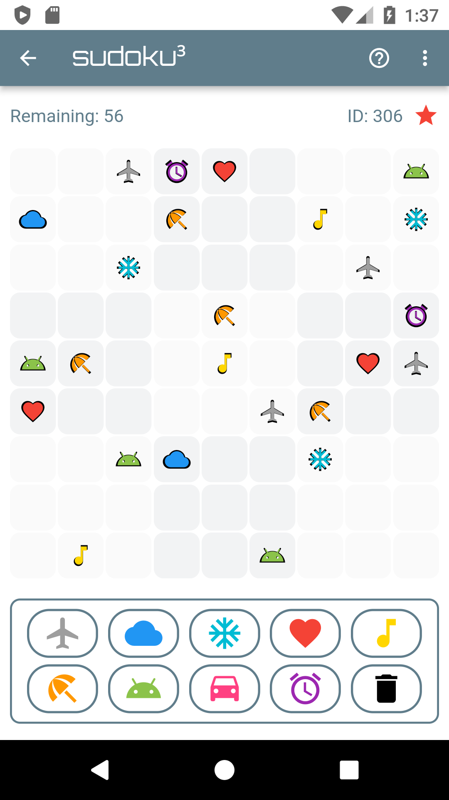

# Sudoku³

A sudoku game for mobile made with Flutter.

# Learn More

For help getting started with Flutter, view our
[online documentation](https://flutter.dev/docs), which offers tutorials,
samples, guidance on mobile development, and a full API reference.

# Install

From the terminal: `flutter pub get`

# Usage

In android > app > build.gradle set `minSdkVersion 21`.
`defaultConfig {`
`minSdkVersion 21`
`}`

# Try It

Run emulator.
From the terminal: `flutter run`

# Motivation

The purpose of this project was to get familiar with Flutter.
